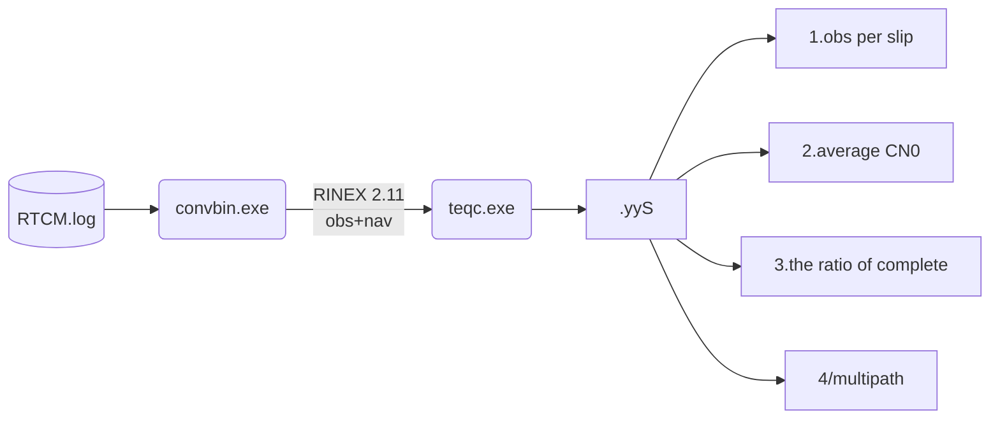
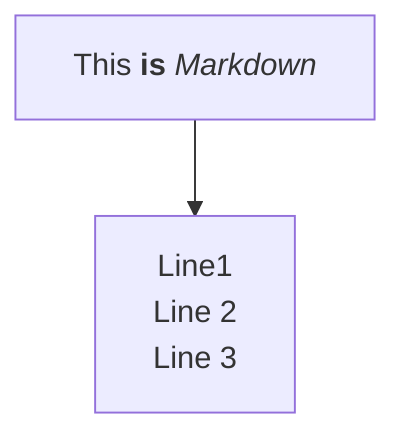

# TEQC develop
## diagram






## TEQC.exe


## Convbin code 
rinex.c 中的outrnxb主要功能是对rinex body进行输出
```rinex.c

extern int outrnxb()
{
  if (opt->rnxver <= 299 && sys == SYS_GPS)
  {
    fprintf(fp, "...");
    sep = "   ";
  }

}


```
